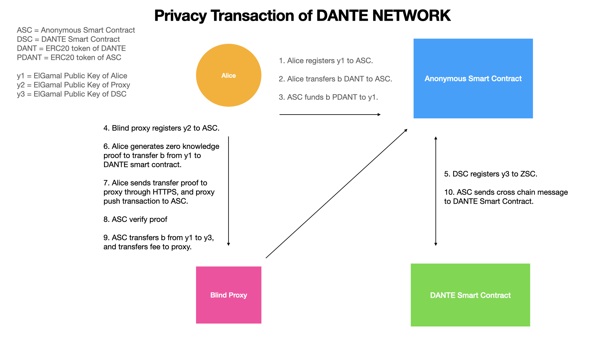

# Privacy transaction solution for Dante Network

## Notation
* This is just for test, so we directly provide related private key in the code. You can use your own private key to try it.
* This demo is better to be executed on the cloud server oversea.

## Running proxy
```
cd proxy
npm i -d
node index.js
```

## Test (Ubuntu Only)
```
npm i -d
./alice
node bob.js
```

## Query transaction by explorer

[PlatON Explorer](https://devnetscan.platon.network/contract-detail?address=0xec1bca6cb9025fc45ff66a876fedbd5d26fa0b90)

[NEAR Explorer](https://explorer.testnet.near.org/accounts/9f9350eb575cae7aac7f85a8c62b08d94dcac70a84e3c765464ff87c669fa4e5)


## Work flow of transfer



## Work flow of hackathon demo


