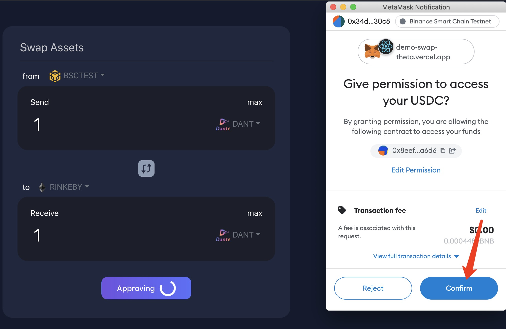
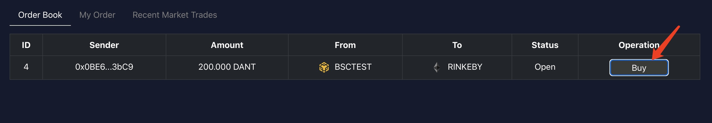

# Demo swap usage instructions
##  Connect wallet
   - Select BSC chain

  

   - Click 'connect to wallet'

 

## Create Order
Create an order to swap 1 DANT token on BSC testnet to Rinkeby.

 Make sure you have sufficient ETH on Rinkeby and BNB on BSC testnet.

 
- [Rinkeby faucet](https://rinkebyfaucet.com/)

- [BSC testnet faucet](https://testnet.binance.org/faucet-smart)

Make sure you have at least 1 DANT in your BSC wallet.(Go to the 'Faucet' tab to claim DANT token)

  
- Create order
  
  
- Approve the transaction

  

- Confirm the order creation, simply click confirm
  
    
- Order created successfully
  
    

## My Order

  Switch to 'Trade' tab under the 'My Order' tab, the newly created order is displayed.

  

##  Make a trade
Switch to another account, make sure you have sufficient ETH on Rinkeby and BNB on BSC testnet for this account.

  - Click the 'Buy' button
 
  

  - Input hash lock word and click confirm
  
    

 - Approve the buy operation
  
   

 - Confirm to buy
  
   

Wait a few seconds for cross-chain transactions to be done.

## Unlock to receive the asset 
- The order status is now 'Locked' , meaning the cross-chain swap is done asset can be unlocked.

  

- Click 'Unlock' and input the hash lock word set in previous step to unlock
 
 

 
